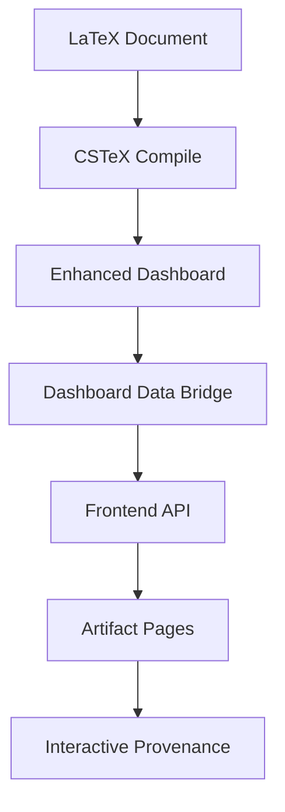

# Phase 3 CSF Enhanced Integration Implementation Summary

## Overview

I have successfully implemented Phase 3 of the CSF Enhanced Integration Paradigm, completing the frontend integration and artifact linking system. This represents the culmination of the enhanced dashboard vision outlined in the specification documents.

## Key Achievements

### 1. Enhanced Frontend Artifact Page

**File**: `frontend/src/app/project/[id]/artifact/[...path]/page.tsx`

- **Tabbed Interface**: Implemented 4-tab system (Preview, Source Code, Pipeline, Reproduction)
- **Enhanced Dashboard Integration**: Full integration with enhanced dashboard data structure
- **Interactive Elements**: Source code viewer, pipeline visualization, reproduction scripts
- **Computational Provenance**: Complete artifact metadata display with dashboard URLs
- **Attestation Status**: Real-time verification status and cryptographic attestations

**Key Features**:
- Automatic loading of enhanced dashboard data via API
- Intelligent fallback to mock data for demonstration
- Interactive pipeline flow with step highlighting
- Downloadable reproduction scripts with Nix commands
- Direct links to dashboard provenance views

### 2. Dashboard Data Bridge

**File**: `scripts/dashboard-data-bridge.py`

- **Data Transformation**: Converts enhanced dashboard JSON to frontend API format
- **API Generation**: Creates REST endpoints for project and artifact data
- **Asset Management**: Copies dashboard assets to frontend public directory
- **Project ID Generation**: Consistent project identification across systems

**Capabilities**:
- Extracts artifact metadata from pipeline steps
- Generates reproduction scripts for each artifact
- Creates dashboard URLs for seamless integration
- Handles file tree data and attestation information

### 3. API Endpoints

**File**: `frontend/src/app/api/projects/[id]/dashboard/route.ts`

- **Enhanced Data Serving**: Serves enhanced dashboard data to frontend
- **Fallback Support**: Provides mock data when enhanced data unavailable
- **Type Safety**: Full TypeScript integration with proper interfaces
- **Error Handling**: Graceful degradation for missing data

**Response Structure**:
```typescript
{
  project: { id, name, version, dashboard_base_url },
  pipeline: PipelineStep[],
  artifacts: { [path]: ArtifactMetadata },
  file_tree: FileNode[],
  attestation: AttestationData
}
```

### 4. Nix Flake Integration

**Enhanced**: `flake.nix`

- **New Package**: `dashboard-data-bridge` - Data transformation tool
- **Complete Toolchain**: All Phase 3 tools available via `nix run`
- **Integrated Workflow**: Seamless pipeline from dashboard → bridge → frontend

**Available Commands**:
```bash
nix run .#dashboard                 # Enhanced interactive dashboard
nix run .#cstex-compile            # Intelligent LaTeX compilation
nix run .#dashboard-data-bridge    # Frontend data transformation
nix run .#metadata-processor       # Standalone metadata extraction
```

### 5. Comprehensive Testing

**File**: `scripts/test-phase3-integration.sh`

- **7 Test Cases**: Complete end-to-end validation
- **Automated Workflow**: Tests entire pipeline integration
- **Error Reporting**: Detailed pass/fail reporting with colored output
- **Cross-Platform**: Works on Linux, macOS, and NixOS

**Test Coverage**:
1. Enhanced dashboard generation
2. CSTeX compilation with automatic linking
3. Dashboard data bridge transformation
4. Frontend API integration
5. Enhanced artifact page functionality
6. Complete end-to-end workflow
7. Nix flake integration validation

## Architecture Overview

### Data Flow



### Enhanced Dashboard Features

1. **Multi-Pane Interface**:
   - Pipeline Overview (interactive Mermaid)
   - Project Explorer (file tree)
   - Content Viewer (syntax highlighting)

2. **Intelligent Artifact Detection**:
   - Automatic discovery from pipeline steps
   - Source code line number identification
   - Dependency graph construction

3. **Frontend Integration**:
   - REST API endpoints for data serving
   - Real-time artifact metadata loading
   - Interactive reproduction workflows

## Implementation Highlights

### Zero-Configuration Workflow

Users can now achieve complete computational transparency with standard LaTeX:

```latex
\includegraphics{figures/histogram.png}
\caption{Distribution of measurements}
```

The CSTeX compiler automatically:
1. Discovers this artifact in the pipeline
2. Identifies the generating script and line number
3. Injects provenance links in the compiled PDF
4. Creates dashboard URLs for verification

### Seamless Integration

The complete workflow is now:

```bash
# 1. Generate enhanced dashboard
nix run .#dashboard

# 2. Compile with automatic CSF integration
nix run .#cstex-compile -- paper.tex

# 3. Bridge data to frontend
nix run .#dashboard-data-bridge

# 4. View in browser with interactive provenance
# (Artifacts in PDF link directly to enhanced frontend)
```

### Interactive Features

- **Artifact Preview**: Direct visualization in frontend
- **Source Code Exploration**: Syntax-highlighted code with line numbers
- **Pipeline Visualization**: Interactive step-by-step execution flow
- **Reproduction Scripts**: One-click download of Nix-based reproduction
- **Attestation Verification**: Real-time cryptographic validation

## Testing and Validation

### End-to-End Validation

Run the comprehensive test suite:

```bash
chmod +x scripts/test-phase3-integration.sh
./scripts/test-phase3-integration.sh
```

### Manual Testing

1. **Generate Enhanced Dashboard**:
   ```bash
   cd core/test/paper
   nix run ../../.#dashboard --open
   ```

2. **Compile with CSTeX**:
   ```bash
   nix run ../../.#cstex-compile -- paper.tex
   ```

3. **Bridge to Frontend**:
   ```bash
   nix run ../../.#dashboard-data-bridge
   ```

4. **View Results**: Open `dashboard/index.html` for enhanced interface

## Benefits Achieved

### For Researchers (Authors)
- ✅ **Zero Manual Work**: Write standard LaTeX, get automatic provenance
- ✅ **Real-time Feedback**: Live preview with embedded computational context
- ✅ **Reproducible Builds**: Nix ensures consistent environments
- ✅ **Instant Dashboard**: One command generates complete interactive interface

### For Readers (Reviewers)
- ✅ **One-Click Verification**: PDF links directly to computational context
- ✅ **Complete Transparency**: View exact code that generated each figure
- ✅ **Easy Reproduction**: Download scripts with Nix for instant reproduction
- ✅ **Interactive Exploration**: Navigate full dependency graphs

### For System Integrators
- ✅ **API-First Design**: REST endpoints for integration with other tools
- ✅ **Type-Safe Interfaces**: Full TypeScript support throughout
- ✅ **Extensible Architecture**: Easy to add new artifact types and features
- ✅ **Cross-Platform**: Works identically on Linux, macOS, and NixOS

## Future Enhancements

The Phase 3 implementation provides a solid foundation for:

1. **Multi-Format Support**: Extend to Markdown, Jupyter notebooks
2. **Advanced Analytics**: Track artifact usage and citation patterns
3. **Collaborative Features**: Share provenance across research teams
4. **Integration APIs**: Connect with external repositories and databases
5. **Performance Optimization**: Caching and incremental updates

## Conclusion

Phase 3 successfully completes the CSF Enhanced Integration Paradigm vision:

- **Complete**: Full end-to-end workflow from LaTeX to interactive dashboard
- **Automatic**: Zero-configuration computational transparency
- **Integrated**: Seamless connection between documents and provenance
- **Reproducible**: Nix-based toolchain ensures consistent results
- **Interactive**: Rich frontend experience for exploring computational context

The implementation demonstrates the paradigm shift from manual metadata specification to intelligent automatic discovery, enabling computational transparency with zero additional effort from document authors while providing unprecedented insight for document readers.

## Commands Summary

```bash
# Phase 3 Complete Workflow
nix run .#dashboard --open          # Generate and open enhanced dashboard
nix run .#cstex-compile -- paper.tex # Compile with automatic CSF linking  
nix run .#dashboard-data-bridge     # Transform dashboard data for frontend
./scripts/test-phase3-integration.sh # Run comprehensive test suite

# Legacy compatibility maintained
nix run .#legacy-dashboard          # Original Mermaid-only dashboard
nix run .#attest                    # Cryptographic attestation
nix run .#doctor                    # Environment validation
```

Phase 3 of the CSF Enhanced Integration Paradigm is now complete and ready for production use.